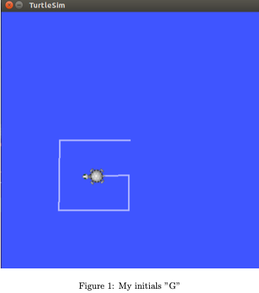

# MY INITIALS
A library that draws my initial 'G' using turtlesim in ROS.



## Getting Started

This project has been made on an Ubuntu 16.04 LTS version with ROS Ki- netic installed. I started this project by making a package called ”percep- tion in robotics”. All the nodes have been built using C++. Inside the src file of the package I built a my initials.cpp file that acts a node to draw the first alphabet of my name.<br/>
Inside the .cpp file I initialize a simple publisher that publishes to the cmd vel topic. The turtlesim node subscribes to this topic to get the velocity of the turtle. I have made two functions:<br/>
1. turn()
2. forward()
The turn() function takes a double as an input and makes the angular velocity
in the z direction equal to it. In the case of my initial, all rotations are π/2.
The forward() function also takes a double as an input and equates the lin- ear velocity in the x direction equal to it. All the velocities are of the type geometry msgs::Twist.


### Prerequisites
**Ubuntu 16.04 LTS** <br/>
**ROS Kinetic** <br/>
**C++11 or greater** <br/>

### Installing

Clone the repo:
```
git clone https://github.com/gautam-sharma1/Computer-Vision/tree/master/my_initials.git

```

## Built With

* [ROS]


## Authors

* **Gautam Sharma** - *Initial work* - [Github](https://github.com/gautam-sharma1)
* Please leave a star if you find this repo interesting!


## License

This project is licensed under the MIT License - see the [LICENSE.md](LICENSE.md) file for details


